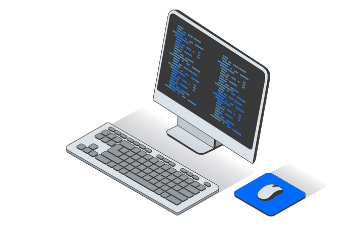

<h1>Hi, Bruno here! </h1>

### Welcome to my profile of GitHub

- 🧑‍💻 I'm developer
- 📘 Network engineering student (UnB)
- 📫 If you want to send a message  **bruno30.serpa@gmail.com**

## 🛠 &nbsp;Tech Stack

  
  
  
  
  
  

## :new_moon: GitHub Analytics

  <a href="https://github.com/Bruno-serpa?tab=repositories">
  
  

## 👨🏻‍💼 &nbsp;Connect with Me

 
 

 

 

 

 
 

